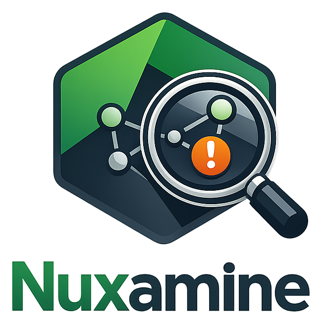

<p align="center">
  
</p>

<h1 align="center">Nuxamine</h1>

<p align="center">
  <strong>Health-Check & Audit Tool for Nuxt Modules</strong><br>
  Find out which modules are well-maintained, Nuxt 4 compatible, and which ones to avoid.
</p>

<p align="center">
  <a href="#features">Features</a> •
  <a href="#scoring">Scoring</a> •
  <a href="#setup">Setup</a> •
  <a href="#tech-stack">Tech Stack</a>
</p>

---

## Features

- **Health Scoring** - Transparent 0-100 score based on reliable data
- **Security Audit** - Vulnerability detection via OSV database
- **Nuxt 4 Compatibility** - Check if modules are ready for Nuxt 4
- **Maintenance Status** - See pending commits, release freshness, CI status
- **Smart Filters** - Filter by category, type, compatibility, quality metrics
- **Favorites** - Track modules you care about
- **Auto-Sync** - Automatic data refresh every 8 hours

## Scoring

Nuxamine calculates a **Risk/Quality Score** (not a popularity contest). 85% of the score comes from reliable data.

| Category | Max Points | What we check |
|----------|------------|---------------|
| **Security** | 15 | No known vulnerabilities |
| **Trust** | 5 | Official (5), Community (3), 3rd-party (0) |
| **Quality** | 30 | Tests (12), TypeScript (10), License (5), CI (3) |
| **Maintenance** | 35 | Publish freshness (20), Release status (15) |
| **Nuxt 4** | 15 | Compatibility signals from multiple sources |

### Penalties (Deal Breakers)

| Issue | Penalty |
|-------|---------|
| Deprecated | -50 |
| Critical vulnerabilities | -40 |
| Archived | -30 |
| High vulnerabilities | -20 |

### Stable & Done Exception

Old modules that are mature get a bonus if they have:
- All changes released
- < 10 open issues
- No vulnerabilities
- CI passing

## Setup

```bash
# Clone
git clone https://github.com/Flo0806/nuxamine.git
cd nuxamine

# Install
pnpm install

# Configure
cp .env.example .env
# Add your GitHub token: NUXT_GITHUB_TOKEN=ghp_xxx

# Run
pnpm dev
```

### Environment Variables

| Variable | Description | Default |
|----------|-------------|---------|
| `NUXT_GITHUB_TOKEN` | GitHub PAT for API access | Required |
| `NUXT_SYNC_LIMIT` | Limit modules for dev (0 = all) | `0` |

## Tech Stack

- **[Nuxt 4](https://nuxt.com)** - Vue framework
- **[NuxtHub](https://hub.nuxt.com)** - KV storage
- **[Nuxt UI v3](https://ui.nuxt.com)** - Component library
- **[Tailwind CSS v4](https://tailwindcss.com)** - Styling

## Data Sources

- [Nuxt Modules API](https://api.nuxt.com/modules)
- [npm Registry](https://registry.npmjs.org)
- [GitHub API](https://api.github.com)
- [OSV Database](https://osv.dev) (vulnerabilities)

## License

MIT
